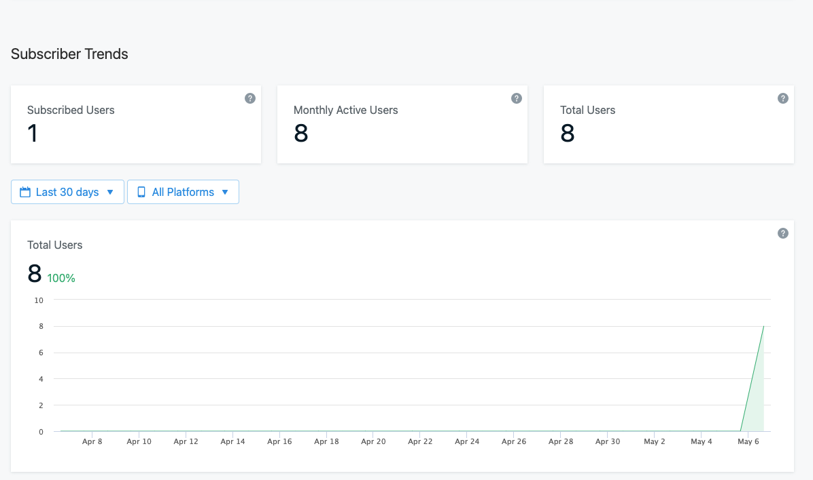

# ONESIGNAL'ın tuttuğu cookie'ler

<NSHTTPCookie
	version:0
	name:__cfduid
	value:d3d56d273765ef1332be9f571ad65f45b1620294554
	expiresDate:'2021-06-05 09:49:14 +0000'
	created:'2021-05-06 09:49:15 +0000'
	sessionOnly:FALSE
	domain:.onesignal.com
	partition:none
	sameSite:lax
	path:/
	isSecure:FALSE
	isHTTPOnly: YES
 path:"/" isSecure:FALSE isHTTPOnly: YES>

Bütün cookie'leri sildim.

let cookieStore = HTTPCookieStorage.shared
for cookie in cookieStore.cookies ?? [] {
    cookieStore.deleteCookie(cookie)
}

# İLK APP KURDUM

OneSignal.setAppId("0b621402-41d4-4522-b390-6bd0aafe03ca")

GET https://api.onesignal.com/apps/0b621402-41d4-4522-b390-6bd0aafe03ca/ios_params.js HTTP/2.0

REQUEST

accept:	application/vnd.onesignal.v1+json
content-type:	application/json
sdk-version:	onesignal/ios/030403
user-agent:	EuromsgExample/3 CFNetwork/978.0.7 Darwin/18.7.0
accept-language:	tr-tr
accept-encoding:	br, gzip, deflate

RESPONSE

date:	Thu, 06 May 2021 10:14:33 GMT
content-type:	application/json; charset=utf-8
set-cookie:	__cfduid=d8f39567474a8b714aedf9a7eaf4d46001620296073; expires=Sat, 05-Jun-21 10:14:33 GMT; path=/; domain=.onesignal.com; HttpOnly; SameSite=Lax
status:	200 OK
cache-control:	public, max-age=3600
access-control-allow-origin:	*
referrer-policy:	strict-origin-when-cross-origin
x-xss-protection:	1; mode=block
x-request-id:	094ffb7a-67c2-481c-b4c7-1f2778ac4348
access-control-allow-headers:	SDK-Version
etag:	W/"060cd0051f794fa455508a924aad81fc"
x-frame-options:	SAMEORIGIN
x-runtime:	0.009443
x-content-type-options:	nosniff
x-powered-by:	Phusion Passenger 5.3.7
cf-cache-status:	HIT
age:	2839
expires:	Thu, 06 May 2021 11:14:33 GMT
cf-request-id:	09e2c51872000050d6460da000000001
expect-ct:	max-age=604800, report-uri="https://report-uri.cloudflare.com/cdn-cgi/beacon/expect-ct"
vary:	Accept-Encoding
server:	cloudflare
cf-ray:	64b1713a59e450d6-IST
content-encoding:	gzip

{
    "outcomes": {
        "direct": {
            "enabled": false
        },
        "indirect": {
            "enabled": false,
            "notification_attribution": {
                "limit": 10,
                "minutes_since_displayed": 60
            }
        },
        "unattributed": {
            "enabled": false
        }
    },
    "receive_receipts_enable": false,
    "uses_provisional_auth": false
}

POST https://api.onesignal.com/players HTTP/2.0

REQUEST

accept:	application/vnd.onesignal.v1+json
content-type:	application/json
user-agent:	EuromsgExample/3 CFNetwork/978.0.7 Darwin/18.7.0
sdk-version:	onesignal/ios/030403
accept-language:	tr-tr
content-length:	514
accept-encoding:	br, gzip, deflate
cookie:	__cfduid=d8f39567474a8b714aedf9a7eaf4d46001620296073

{
    "app_id": "0b621402-41d4-4522-b390-6bd0aafe03ca",
    "device_model": "iPhone7,2",
    "device_os": "12.5.2",
    "device_type": 0,
    "game_version": "1.3",
    "identifier": "2f2698460c548ec76ad40079118d734b0d54446cd040650cbc6c7222b8f855f2",
    "ios_bundle": "com.relateddigital.EuromsgExample",
    "language": "tr-TR",
    "net_type": 0,
    "notification_types": -18,
    "sdk": "030403",
    "sdk_type": "030403",
    "tags": {},
    "test_type": 1,
    "timezone": 10800,
    "timezone_id": "Europe/Istanbul"
}

RESPONSE

date:	Thu, 06 May 2021 10:15:04 GMT
content-type:	application/json; charset=utf-8
status:	200 OK
cache-control:	max-age=0, private, must-revalidate
access-control-allow-origin:	*
referrer-policy:	strict-origin-when-cross-origin
x-xss-protection:	1; mode=block
x-request-id:	70b452bb-d9f4-4782-9563-0407bd1c8c74
access-control-allow-headers:	SDK-Version
etag:	W/"375c07b1ed9ff3209e55c896d5ab4bed"
x-frame-options:	SAMEORIGIN
x-runtime:	0.043056
x-content-type-options:	nosniff
x-powered-by:	Phusion Passenger 6.0.4
cf-cache-status:	DYNAMIC
cf-request-id:	09e2c58fa8000050f983923000000001
expect-ct:	max-age=604800, report-uri="https://report-uri.cloudflare.com/cdn-cgi/beacon/expect-ct"
server:	cloudflare
cf-ray:	64b171f90e9750f9-IST
content-encoding:	gzip

{
    "id": "342534b1-512b-418c-8476-cf4580e7f774",
    "success": true
}

# APP'İ YENİDEN KURDUM

GET https://api.onesignal.com/apps/0b621402-41d4-4522-b390-6bd0aafe03ca/ios_params.js?player_id=342534b1-512b-418c-8476-cf4580e7f774 HTTP/2.0

REQUEST

accept:	application/vnd.onesignal.v1+json
content-type:	application/json
sdk-version:	onesignal/ios/030403
accept-language:	tr-tr
user-agent:	EuromsgExample/3 CFNetwork/978.0.7 Darwin/18.7.0
accept-encoding:	br, gzip, deflate
cookie:	__cfduid=d8f39567474a8b714aedf9a7eaf4d46001620296073

RESPONSE

date:	Thu, 06 May 2021 10:24:20 GMT
content-type:	application/json; charset=utf-8
status:	200 OK
cache-control:	public, max-age=3600
access-control-allow-origin:	*
referrer-policy:	strict-origin-when-cross-origin
x-xss-protection:	1; mode=block
x-request-id:	094ffb7a-67c2-481c-b4c7-1f2778ac4348
access-control-allow-headers:	SDK-Version
etag:	W/"060cd0051f794fa455508a924aad81fc"
x-frame-options:	SAMEORIGIN
x-runtime:	0.009443
x-content-type-options:	nosniff
x-powered-by:	Phusion Passenger 5.3.7
cf-cache-status:	HIT
age:	3426
expires:	Thu, 06 May 2021 11:24:20 GMT
cf-request-id:	09e2ce0f930000508711bcb000000001
expect-ct:	max-age=604800, report-uri="https://report-uri.cloudflare.com/cdn-cgi/beacon/expect-ct"
vary:	Accept-Encoding
server:	cloudflare
cf-ray:	64b17f928f835087-IST
content-encoding:	gzip

POST https://api.onesignal.com/players/342534b1-512b-418c-8476-cf4580e7f774/on_session HTTP/2.0

REQUEST

accept:	application/vnd.onesignal.v1+json
content-type:	application/json
user-agent:	EuromsgExample/3 CFNetwork/978.0.7 Darwin/18.7.0
sdk-version:	onesignal/ios/030403
accept-language:	tr-tr
content-length:	460
accept-encoding:	br, gzip, deflate
cookie:	__cfduid=d8f39567474a8b714aedf9a7eaf4d46001620296073

RESPONSE

accept:	application/vnd.onesignal.v1+json
content-type:	application/json
user-agent:	EuromsgExample/3 CFNetwork/978.0.7 Darwin/18.7.0
sdk-version:	onesignal/ios/030403
accept-language:	tr-tr
content-length:	460
accept-encoding:	br, gzip, deflate
cookie:	__cfduid=d8f39567474a8b714aedf9a7eaf4d46001620296073

{
    "app_id": "0b621402-41d4-4522-b390-6bd0aafe03ca",
    "device_model": "iPhone7,2",
    "device_os": "12.5.2",
    "device_type": 0,
    "game_version": "1.3",
    "identifier": "2f2698460c548ec76ad40079118d734b0d54446cd040650cbc6c7222b8f855f2",
    "language": "tr-TR",
    "net_type": 0,
    "notification_types": -18,
    "sdk": "030403",
    "sdk_type": "030403",
    "tags": {},
    "test_type": 1,
    "timezone": 10800,
    "timezone_id": "Europe/Istanbul"
}

# APP'İ SİLİP TEKRAR YÜKLEDİM

GET https://api.onesignal.com/apps/0b621402-41d4-4522-b390-6bd0aafe03ca/ios_params.js HTTP/2.0

REQUEST

accept:	application/vnd.onesignal.v1+json
content-type:	application/json
sdk-version:	onesignal/ios/030403
user-agent:	EuromsgExample/4 CFNetwork/978.0.7 Darwin/18.7.0
accept-language:	tr-tr
accept-encoding:	br, gzip, deflate

RESPONSE

date:	Thu, 06 May 2021 10:31:05 GMT
content-type:	application/json; charset=utf-8
set-cookie:	__cfduid=d3b627b2252818bac4a9342821084eaa51620297065; expires=Sat, 05-Jun-21 10:31:05 GMT; path=/; domain=.onesignal.com; HttpOnly; SameSite=Lax
status:	200 OK
cache-control:	public, max-age=3600
access-control-allow-origin:	*
referrer-policy:	strict-origin-when-cross-origin
x-xss-protection:	1; mode=block
x-request-id:	094ffb7a-67c2-481c-b4c7-1f2778ac4348
access-control-allow-headers:	SDK-Version
etag:	W/"060cd0051f794fa455508a924aad81fc"
x-frame-options:	SAMEORIGIN
x-runtime:	0.009443
x-content-type-options:	nosniff
x-powered-by:	Phusion Passenger 5.3.7
cf-cache-status:	REVALIDATED
expires:	Thu, 06 May 2021 11:31:05 GMT
cf-request-id:	09e2d43a320000e18a0635b000000001
expect-ct:	max-age=604800, report-uri="https://report-uri.cloudflare.com/cdn-cgi/beacon/expect-ct"
vary:	Accept-Encoding
server:	cloudflare
cf-ray:	64b1897058ece18a-IST
content-encoding:	gzip

{
    "outcomes": {
        "direct": {
            "enabled": false
        },
        "indirect": {
            "enabled": false,
            "notification_attribution": {
                "limit": 10,
                "minutes_since_displayed": 60
            }
        },
        "unattributed": {
            "enabled": false
        }
    },
    "receive_receipts_enable": false,
    "uses_provisional_auth": false
}

POST https://api.onesignal.com/players HTTP/2.0

REQUEST

accept:	application/vnd.onesignal.v1+json
content-type:	application/json
user-agent:	EuromsgExample/4 CFNetwork/978.0.7 Darwin/18.7.0
sdk-version:	onesignal/ios/030403
accept-language:	tr-tr
content-length:	514
accept-encoding:	br, gzip, deflate
cookie:	__cfduid=d3b627b2252818bac4a9342821084eaa51620297065

{
    "app_id": "0b621402-41d4-4522-b390-6bd0aafe03ca",
    "device_model": "iPhone7,2",
    "device_os": "12.5.2",
    "device_type": 0,
    "game_version": "1.4",
    "identifier": "790fdfb47881052ba1d93dcf088b518788f670c0c5d535d8adca0eb52dee77c0",
    "ios_bundle": "com.relateddigital.EuromsgExample",
    "language": "tr-TR",
    "net_type": 0,
    "notification_types": -18,
    "sdk": "030403",
    "sdk_type": "030403",
    "tags": {},
    "test_type": 1,
    "timezone": 10800,
    "timezone_id": "Europe/Istanbul"
}

RESPONSE

date:	Thu, 06 May 2021 10:31:35 GMT
content-type:	application/json; charset=utf-8
status:	200 OK
cache-control:	max-age=0, private, must-revalidate
access-control-allow-origin:	*
referrer-policy:	strict-origin-when-cross-origin
x-xss-protection:	1; mode=block
x-request-id:	caedbede-d2c5-4901-beef-67c01fb76015
access-control-allow-headers:	SDK-Version
etag:	W/"7a5b675df258b975fc86ab68e4af4795"
x-frame-options:	SAMEORIGIN
x-runtime:	0.030867
x-content-type-options:	nosniff
x-powered-by:	Phusion Passenger 5.3.7
cf-cache-status:	DYNAMIC
cf-request-id:	09e2d4af89000051063e138000000001
expect-ct:	max-age=604800, report-uri="https://report-uri.cloudflare.com/cdn-cgi/beacon/expect-ct"
server:	cloudflare
cf-ray:	64b18a2c098b5106-IST
content-encoding:	gzip

{
    "id": "4e5146c9-7121-4144-93e6-ea5fcccac1e5",
    "success": true
}

# UYGULAMAYI ARKA PLANA ALDIM

POST https://api.onesignal.com/players/4e5146c9-7121-4144-93e6-ea5fcccac1e5/on_focus HTTP/2.0

REQUEST

accept: application/vnd.onesignal.v1+json
content-type:   application/json
user-agent: EuromsgExample/4 CFNetwork/978.0.7 Darwin/18.7.0
sdk-version:    onesignal/ios/030403
accept-language:    tr-tr
content-length: 186
accept-encoding:    br, gzip, deflate
cookie: __cfduid=d3b627b2252818bac4a9342821084eaa51620297065

{
    "active_time": 2227.1777069568634,
    "app_id": "0b621402-41d4-4522-b390-6bd0aafe03ca",
    "device_type": 0,
    "direct": false,
    "net_type": 0,
    "state": "ping",
    "type": 1
}

RESPONSE

date:   Thu, 06 May 2021 11:08:12 GMT
content-type:   application/json
access-control-allow-origin:    *
cf-cache-status:    DYNAMIC
cf-request-id:  09e2f6380b0000cb32651b9000000001
expect-ct:  max-age=604800, report-uri="https://report-uri.cloudflare.com/cdn-cgi/beacon/expect-ct"
server: cloudflare
cf-ray: 64b1bfd3494ccb32-IST
content-encoding:   gzip

{
    "id": "4e5146c9-7121-4144-93e6-ea5fcccac1e5",
    "success": true
}

# APP'İ SİLİP TEKRAR KURDUM

GET https://api.onesignal.com/apps/0b621402-41d4-4522-b390-6bd0aafe03ca/ios_params.js HTTP/2.0

REQUEST

accept: application/vnd.onesignal.v1+json
content-type:   application/json
sdk-version:    onesignal/ios/030403
user-agent: EuromsgExample/4 CFNetwork/978.0.7 Darwin/18.7.0
accept-language:    tr-tr
accept-encoding:    br, gzip, deflate

RESPONSE

date:   Thu, 06 May 2021 11:15:47 GMT
content-type:   application/json; charset=utf-8
set-cookie: __cfduid=d8f85967a644d1009f6c72327954f23741620299747; expires=Sat, 05-Jun-21 11:15:47 GMT; path=/; domain=.onesignal.com; HttpOnly; SameSite=Lax
status: 200 OK
cache-control:  public, max-age=3600
access-control-allow-origin:    *
referrer-policy:    strict-origin-when-cross-origin
x-xss-protection:   1; mode=block
x-request-id:   094ffb7a-67c2-481c-b4c7-1f2778ac4348
access-control-allow-headers:   SDK-Version
etag:   W/"060cd0051f794fa455508a924aad81fc"
x-frame-options:    SAMEORIGIN
x-runtime:  0.009443
x-content-type-options: nosniff
x-powered-by:   Phusion Passenger 5.3.7
cf-cache-status:    HIT
age:    2682
expires:    Thu, 06 May 2021 12:15:47 GMT
cf-request-id:  09e2fd29770000e186a09ad000000001
expect-ct:  max-age=604800, report-uri="https://report-uri.cloudflare.com/cdn-cgi/beacon/expect-ct"
vary:   Accept-Encoding
server: cloudflare
cf-ray: 64b1caef2d9fe186-IST
content-encoding:   gzip

POST https://api.onesignal.com/players HTTP/2.0

REQUEST

accept: application/vnd.onesignal.v1+json
content-type:   application/json
user-agent: EuromsgExample/4 CFNetwork/978.0.7 Darwin/18.7.0
sdk-version:    onesignal/ios/030403
accept-language:    tr-tr
content-length: 514
accept-encoding:    br, gzip, deflate
cookie: __cfduid=d8f85967a644d1009f6c72327954f23741620299747

{
    "app_id": "0b621402-41d4-4522-b390-6bd0aafe03ca",
    "device_model": "iPhone7,2",
    "device_os": "12.5.2",
    "device_type": 0,
    "game_version": "1.4",
    "identifier": "2110ef0d06fe83a04cda9d1adb737807e92fd7d31f9574163c2b6a76a619550d",
    "ios_bundle": "com.relateddigital.EuromsgExample",
    "language": "tr-TR",
    "net_type": 0,
    "notification_types": -18,
    "sdk": "030403",
    "sdk_type": "030403",
    "tags": {},
    "test_type": 1,
    "timezone": 10800,
    "timezone_id": "Europe/Istanbul"
}

RESPONSE

date:   Thu, 06 May 2021 11:16:17 GMT
content-type:   application/json; charset=utf-8
status: 200 OK
cache-control:  max-age=0, private, must-revalidate
access-control-allow-origin:    *
referrer-policy:    strict-origin-when-cross-origin
x-xss-protection:   1; mode=block
x-request-id:   6e4d624b-2943-4808-b313-3ad254242650
access-control-allow-headers:   SDK-Version
etag:   W/"183aa69a4bed89573d82f6ad44489a44"
x-frame-options:    SAMEORIGIN
x-runtime:  0.038590
x-content-type-options: nosniff
x-powered-by:   Phusion Passenger 5.3.7
cf-cache-status:    DYNAMIC
cf-request-id:  09e2fd9ec3000050dcf1998000000001
expect-ct:  max-age=604800, report-uri="https://report-uri.cloudflare.com/cdn-cgi/beacon/expect-ct"
server: cloudflare
cf-ray: 64b1cbaad94e50dc-IST
content-encoding:   gzip

{
    "id": "6e181fe2-c8ed-4ea4-849b-bd975a441183",
    "success": true
}

# APP'İ SİLİP TEKRAR KURDUM

let cookieStore = HTTPCookieStorage.shared
for cookie in cookieStore.cookies ?? [] {
    print(cookie)
}

hiç cookie yazmadı.

GET https://api.onesignal.com/apps/0b621402-41d4-4522-b390-6bd0aafe03ca/ios_params.js HTTP/2.0

REQUEST

accept: application/vnd.onesignal.v1+json
content-type:   application/json
sdk-version:    onesignal/ios/030403
user-agent: EuromsgExample/4 CFNetwork/978.0.7 Darwin/18.7.0
accept-language:    tr-tr
accept-encoding:    br, gzip, deflate

RESPONSE

date:   Thu, 06 May 2021 11:32:07 GMT
content-type:   application/json; charset=utf-8
set-cookie: __cfduid=dc0170b9b796eaf35abf6fd8f394489c61620300727; expires=Sat, 05-Jun-21 11:32:07 GMT; path=/; domain=.onesignal.com; HttpOnly; SameSite=Lax
status: 200 OK
cache-control:  public, max-age=3600
access-control-allow-origin:    *
referrer-policy:    strict-origin-when-cross-origin
x-xss-protection:   1; mode=block
x-request-id:   094ffb7a-67c2-481c-b4c7-1f2778ac4348
access-control-allow-headers:   SDK-Version
etag:   W/"060cd0051f794fa455508a924aad81fc"
x-frame-options:    SAMEORIGIN
x-runtime:  0.009443
x-content-type-options: nosniff
x-powered-by:   Phusion Passenger 5.3.7
cf-cache-status:    REVALIDATED
expires:    Thu, 06 May 2021 12:32:07 GMT
cf-request-id:  09e30c1aff00005105a50ae000000001
expect-ct:  max-age=604800, report-uri="https://report-uri.cloudflare.com/cdn-cgi/beacon/expect-ct"
vary:   Accept-Encoding
server: cloudflare
cf-ray: 64b1e2d7fcd65105-IST
content-encoding:   gzip

{
    "outcomes": {
        "direct": {
            "enabled": false
        },
        "indirect": {
            "enabled": false,
            "notification_attribution": {
                "limit": 10,
                "minutes_since_displayed": 60
            }
        },
        "unattributed": {
            "enabled": false
        }
    },
    "receive_receipts_enable": false,
    "uses_provisional_auth": false
}

POST https://api.onesignal.com/players HTTP/2.0

REQUEST

accept: application/vnd.onesignal.v1+json
content-type:   application/json
user-agent: EuromsgExample/4 CFNetwork/978.0.7 Darwin/18.7.0
sdk-version:    onesignal/ios/030403
accept-language:    tr-tr
content-length: 514
accept-encoding:    br, gzip, deflate
cookie: __cfduid=dc0170b9b796eaf35abf6fd8f394489c61620300727

{
    "app_id": "0b621402-41d4-4522-b390-6bd0aafe03ca",
    "device_model": "iPhone7,2",
    "device_os": "12.5.2",
    "device_type": 0,
    "game_version": "1.4",
    "identifier": "9273058f22ee86c93cbebd734370d89f3b0051d864ac147dd5773e7e9ef55d1e",
    "ios_bundle": "com.relateddigital.EuromsgExample",
    "language": "tr-TR",
    "net_type": 0,
    "notification_types": -18,
    "sdk": "030403",
    "sdk_type": "030403",
    "tags": {},
    "test_type": 1,
    "timezone": 10800,
    "timezone_id": "Europe/Istanbul"
}

RESPONSE

date:   Thu, 06 May 2021 11:32:37 GMT
content-type:   application/json; charset=utf-8
status: 200 OK
cache-control:  max-age=0, private, must-revalidate
access-control-allow-origin:    *
referrer-policy:    strict-origin-when-cross-origin
x-xss-protection:   1; mode=block
x-request-id:   728608b6-7fd5-4f92-9982-e6df10fad8c4
access-control-allow-headers:   SDK-Version
etag:   W/"93d986a500027b04715ee568ba22538b"
x-frame-options:    SAMEORIGIN
x-runtime:  0.031498
x-content-type-options: nosniff
x-powered-by:   Phusion Passenger 5.3.7
cf-cache-status:    DYNAMIC
cf-request-id:  09e30c8f970000510629b29000000001
expect-ct:  max-age=604800, report-uri="https://report-uri.cloudflare.com/cdn-cgi/beacon/expect-ct"
server: cloudflare
cf-ray: 64b1e3928f5c5106-IST
content-encoding:   gzip

{
    "id": "e8720d60-3344-43b3-bb1a-ab473b1a61d9",
    "success": true
}

https://documentation.onesignal.com/docs/users

iOS Unsubscribe Detection

Apple changed the way it reports unsubscribe events on iOS apps.

In the past, they would report the unsubscribed device upon the 2nd notification. They stopped doing this for privacy reasons. Apple intentionally does not want token invalidation to be used as a method to detect app uninstall.

Some details provided by Apple can be found here: https://forums.developer.apple.com/thread/116445

Currently if a device unsubscribes and opens the app, we detect this right away through our SDK. However if the device uninstalls the app or unsubscribes and does not open the app, it may take several weeks for Apple to report the device unsubscribe event.

If you need to remove older devices, you can delete them using our dashboard or API(https://documentation.onesignal.com/docs/delete-users).

